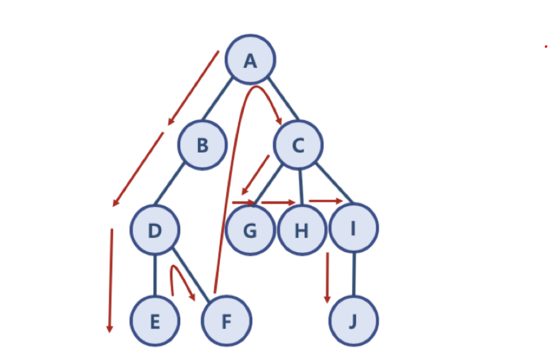

## DFS (깊이 우선)
- 인접한 거 다 넣고 ``뒤``에서 빼면 dfs..
- 근데 오른쪽 끝 노드부터 검사하는 듯?

### 1. 초기 상태 및 코드
####  스택 : now
#### a : 
`dq = deque([start])`

visted가 0 이면 바로 스택에 넣는다

### 2. dfs()함수에서 인접 노드 검색한 직후의 상태 및 코드

####  스택 : now
#### b c : a
#### b g h i : c
#### b g h j : i
#### b g h : j
#### b g : h

...

```python
# dfs() 함수 공식

#스택에 넣은 것들은 방문 가능한 노드들
while dq:
    # 일단 뒤에서 빼
    now = dq.pop()

    # 빼는 순간 방문처리
    visited[now]= 1

    # 중간에 원하는 거 찾을 조건 같은 거 넣기!

    # 인접한 노드들 함 보자
    for next in arr[now]:
        # visted가 0 이면 바로 스택에 넣는다
        if visited[next] == 0:
            dq.append(arr[next])
```

방문하는 노드 순서 : a -> c -> i -> j -> h -> g -> b -> d -> f -> e

## BFS (너비 우선)
- 인접한 거 다 넣고 ``앞``에서 빼면 bfs

### 1. 초기 상태 및 코드
####  스택 : now
#### a : 
`dq = deque([start])`

### 2. bfs()함수에서 인접 노드 검색한 직후의 상태 및 코드

####  스택 : now
#### b c : a
#### c d : b
#### d g h i : c
#### g h i e f : d
#### h i e f : g
#### i e f : h
#### e f j : i
#### f j : e
#### j : f
#### : j

```python
# bfs() 함수 공식

#스택에 넣은 것들은 방문 가능한 노드들
while dq:
    # 일단 앞에서 빼
    now = dq.popleft()

    # 빼는 순간 방문처리
    visited[now]= 1

    # 중간에 원하는 거 찾을 조건 같은 거 넣기!

    # 인접한 노드들 함 보자
    for next in arr[now]:
        # visted가 0 이면 바로 스택에 넣는다
        if visited[next] == 0:
            dq.append(arr[next])
```

방문하는 노드 순서 : a -> b -> c -> d -> g -> h-> i -> e -> f -> j